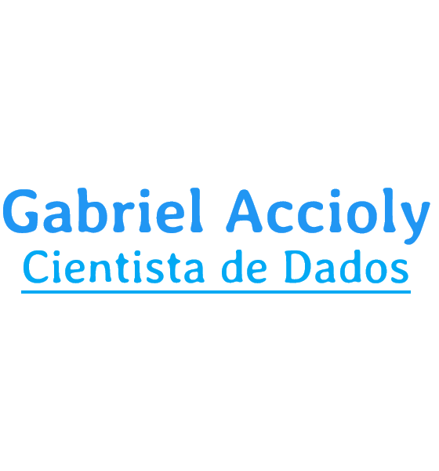

  
  

  
  

## Ola a Todos! </h2>
- Gosto de ser chamado pelo meu sobrenome Accioly😄👌
- Tenho setup🖥️ para diversos desafios
- Com o tempo eu perco um pouco da minha cara de bravo😡

### Sobre
Eu estudo programaçao desde 2017, comecei com Portugol e logo conheci o curso do Gustavo Guanabara, fiz todos os mundos, me apaixonei por Python e no ano de 2019 assinei o curso Alura +1000 cursos abertos durante 1 ano de assinatura, foi fantastico, aprendi muito sobre Python e comecei a entrar no mundo da Ciencia de Dados, e como consequencia aprendi R, minha base forte é o Python, mas hoje me garanto no R. Minha assinatura na Alura vai acabar em Novembro de 2020, ja me antecipei e assinei o LinkedIn learning pela grande quantidade de cursos de R e estatistica, nessa reta final do ano estou exercitando e praticando meu ingles, Ano que vem eu inicio minha faculdade de Estatistica.

### Projetos em Python

### Projetos em R

### Linguagens e Ferramentas

 

  
  
  
  

### Como me achar 🌎:
- 💼 Linkedin: <a href="https://www.linkedin.com/in/oaccioly/">Linkedin.com/in/oAccioly/</a>.
- 📧 Gmail: Gabriel.oaccioly@gmail.com

<h1 class="content-item-title" style="border-color: #00c86f;">
  <a href="https://cursos.alura.com.br/user/Oaccioly/fullCertificate/95021c9facfec1bb030bdfd2dcd5e55d">
                  Certificados Alura
  </a>
            </h1>
                        
Horas Estudadas: **642 horas** ⏰

Cursos Concluidos: **75** 📜

Exercícios Resolvidos: **1879** 🖊️

<h2 class="content-item-title" style="border-color: #00c86f;">Formação: Python</h2>

    Python 3 parte 1: Introdução à nova versão da linguagem (de 29/11/2019 a 30/11/2019) 12hrs
    Python 3 parte 2: Avançando na linguagem (de 30/11/2019 a 30/11/2019) 12hrs
    Python 3: Introdução a Orientação a objetos (de 30/11/2019 a 02/12/2019) 12hrs
    Python 3: Avançando na orientação a objetos (de 02/12/2019 a 04/12/2019) 10hrs
    Testes automatizados: TDD com Python (de 02/12/2019 a 01/03/2020) 6hrs
    Python: Manipulação de Strings (de 02/12/2019 a 27/01/2020) 7hrs
    Python Collections parte 1: Listas e tuplas (de 02/12/2019 a 03/02/2020) 8hrs
    Python Collections parte 2: Conjuntos e dicionários (de 02/12/2019 a 04/02/2020) 9hrs
    Python Brasil: Validação de dados no padrão nacional (de 02/12/2019 a 08/02/2020) 7hrs
    
<h2 class="content-item-title" style="border-color: #00c86f;">Formação: Python para Data Science</h2>
    
    Python para Data Science: Funções, Pacotes e Pandas básico (de 12/02/2020 a 13/02/2020) 10hrs
    Python para Data Science: Introdução à linguagem e Numpy (de 11/02/2020 a 12/02/2020) 12hrs
    Python Pandas: Tratando e analisando dados (de 13/02/2020 a 29/02/2020) 12hrs
    Python para Data Science: Primeiros passos (de 18/07/2020 a 18/07/2020) 10hrs 
    Data Visualization: Explorando com Seaborn (de 14/07/2020 a 17/07/2020) 6hrs
    Data analysis: introdução a séries temporais e análises (de 08/03/2020 a 08/03/2020) 8hrs
    Data Science: Introdução a análise de series temporais (de 18/07/2020 a 18/07/2020) 6hrs
    Data Science: Primeiros passos (de 29/02/2020 a 01/03/2020) 6hrs
    Data Science: Introdução a testes estatísticos com Python (de 01/04/2020 a 17/07/2020) 6hrs
    Pandas: Formatos diferentes de entrada e saída (IO) (de 17/07/2020 a 17/07/2020) 6hrs
    Estatística com Python parte 1: Frequências e Medidas (de 15/03/2020 a 17/03/2020) 10hrs
    Estatística com Python parte 2: Probabilidade e Amostragem (de 08/05/2020 a 09/05/2020) 10hrs
    Scraping com Python: Coleta de dados na web (de 07/04/2020 a 09/04/2020) 10hrs
    Python Scikit-Learn: regressão, classificação e clustering (de 18/07/2020 a 18/07/2020) 10hrs
    Corretor Ortográfico em Python: Aplicando técnicas de NLP (de 10/05/2020 a 18/07/2020) 10hrs
    Machine Learning: Classificação por trás dos panos (de 21/09/2020 a 04/10/2020) 10hrs
    Business Intelligence: Introdução à inteligência empresarial (de 09/04/2020 a 17/04/2020) 12hrs 
    
<h2 class="content-item-title" style="border-color: #00c86f;">Formação: R para Data Science</h2>
            
    Análise de dados: Introdução com R (de 11/04/2020 a 22/04/2020) 8hrs
    Data Science: O pipeline dos dados (de 17/04/2020 a 17/04/2020) 8hrs
    Data Science: Preparação e exploração dos dados (de 07/05/2020 a 07/05/2020) 8hrs
    Data Visualization parte 1: introdução ao design de gráficos (de 14/07/2020 a 14/07/2020) 15hrs
    Data Visualization parte 2: Escolhendo o melhor gráfico (de 14/07/2020 a 14/07/2020) 6hrs
    Regressão Linear Simples em R: Correlação e Previsão (de 12/09/2020 a 12/09/2020) 4hrs
    Regressão Linear: Testando Relações e Prevendo Resultados (de 10/03/2020 a 11/09/2020) 12hrs
    Regressão Linear: Técnicas Avançadas de Modelagem (de 18/03/2020 a 12/09/2020) 5hrs
    Estatística com R: Introdução à modelagem (de 23/06/2020 a 26/06/2020) 8hrs
    Estatística I: Entenda seus dados com R (de 11/04/2020 a 11/04/2020) 8hrs
    Estatística II: Aprofundando em hipóteses e correlações (de 17/04/2020 a 17/04/2020) 8hrs
    
<h2 class="content-item-title" style="border-color: #00c86f;">Gerente Ágil - Metodologia Agile | Alura</h2>               
    
    Scrum: Agilidade em seu projeto (de 04/12/2019 a 13/12/2019) 10hrs
    Scrum parte 1: Gerencie o seu projeto de forma ágil (de 18/01/2020 a 23/01/2020) 5hrs
    Liderança parte 1: Seja líder no novo mercado (de 05/12/2019 a 07/12/2019) 8hrs
    Liderança parte 2: seja o líder que o mercado procura (de 06/12/2019 a 28/02/2020) 12hrs
    Fundamentos de Agilidade: seus primeiros passos para a transformação ágil (de 03/12/2019 a 05/12/2019) 6hrs

  <h2 class="content-item-title" style="border-color: #00c86f;">Desenvolvimento Pessoal</h2>   
    
    Hábitos: da produtividade às metas pessoais (de 18/03/2020 a 21/03/2020) 8hrs
    Comunicação: Como se expressar bem e ser compreendido (de 21/03/2020 a 30/03/2020) 8hrs
    Relacionamento interpessoal: aprenda a lidar melhor com você e com o outro (de 30/03/2020 a 30/03/2020) 10hrs
    Feedback: a arte de orientar e ser orientado com sentido (de 30/03/2020 a 30/03/2020) 2hrs
    Foco: Trazendo mais resultados para o dia a dia (de 21/03/2020 a 21/03/2020) 10hrs
    Eficácia parte 1: Hábitos para sua proatividade (de 21/03/2020 a 21/03/2020) 6hrs
    Eficácia parte 2: Hábitos para sua proatividade (de 21/03/2020 a 21/03/2020) 4hrs
    Pontos fortes parte 1: descubra os seus e aprenda a gerenciá-los (de 21/03/2020 a 21/03/2020) 4hrs
    Pontos fortes parte 2: Habilidades e competências (de 21/03/2020 a 21/03/2020) 4hrs
    Oratória parte 1: Compartilhe ideias e histórias (de 30/03/2020 a 30/03/2020) 8hrs
    Oratória parte 2: Apresentações em público (de 30/03/2020 a 30/03/2020) 6hrs
    Estresse parte 1: buscando qualidade de vida (de 21/03/2020 a 21/03/2020) 2hrs
    Estresse parte 2: Equilibre seu estilo de vida (de 21/03/2020 a 21/03/2020) 8hrs
